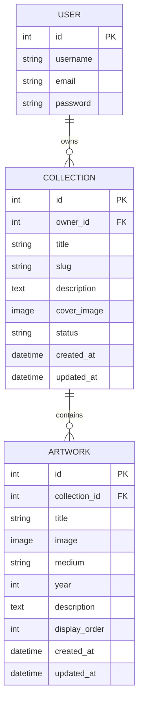

# RaigonOS

Developer: Railson Gonçalves ([raigonlab](https://www.github.com/raigonlab))

[](https://www.github.com/raigonlab/raigonos/commits/main)
[](https://www.github.com/raigonlab/raigonos/commits/main)
[](https://www.github.com/raigonlab/raigonos)
[](#)

> 🚧 **This README is being written progressively as the project is built.**
> Sections marked with 🚧 are placeholders and will be completed as the
> corresponding feature, wireframe or screenshot is produced.

---

## Project Introduction and Rationale

RaigonOS is a full-stack gallery management platform built with Django and
PostgreSQL, allowing an artist to catalogue, organise and present their art
**Collections** and individual **Artworks** online, with full create, read,
update and delete control over their own content.

It is a conceptual continuation of [raigon](https://raigonlab.github.io/raigon-mmxi) —
a static, single-page gallery built with HTML, CSS and JavaScript only — but
rebuilt entirely from scratch as a dynamic, database-backed application.
No code from that project is reused; only the domain (an artist's digital
gallery) carries over, as permitted by the assessment brief.

**Target audience**

- **Primary — the site owner (artist):** needs a simple, dependable tool to
  manage their portfolio (add/edit/remove Collections and Artworks) without
  touching code.
- **Secondary — visitors:** collectors, peers and the public browsing the
  published gallery.

**Value provided**

- The artist gets a private, authenticated back office to manage their
  public-facing gallery content directly.
- Visitors get organised, structured access to an artist's body of work,
  grouped into Collections.

**Key technical decisions**

- Django + PostgreSQL, with two core related models — `Collection` and
  `Artwork` (one-to-many) — kept deliberately minimal for the MVP.
- Authentication restricts all create/edit/delete actions to the
  authenticated owner; the public gallery remains read-only for visitors.
- Configuration (`SECRET_KEY`, `DEBUG`, `DATABASE_URL`, allowed hosts) is
  entirely environment-variable driven, so the same codebase runs unchanged
  locally (SQLite) and in production (Render + PostgreSQL).
- Uploaded images are stored on Cloudinary in production (switched on via
  `CLOUDINARY_CLOUD_NAME`/`CLOUDINARY_API_KEY`/`CLOUDINARY_API_SECRET`),
  since Render's own filesystem is wiped on every deploy and cannot be
  used for persistent user uploads.

**Long-term vision (explicitly out of scope for this MVP)**

Beyond this submission, RaigonOS is conceived as something bigger than a
single-artist portfolio tool: a secure, lifelong archive where any artist
can catalogue their entire body of work as it grows — a robust visual
record of their artistic journey, not just a gallery for the present.
None of the following is built or planned for this cycle; it's recorded
here to document the reasoning behind decisions like the extensible
`owner`-based data model.

- **A record of the artist's evolution.** Because Collections and
  Artworks are timestamped and organised chronologically, the platform
  is naturally positioned to show how an artist's style and body of
  work developed over their career, not just a snapshot of current
  pieces.
- **Public exhibition beyond the site itself.** Artwork catalogued here
  could be surfaced into real public spaces — museum displays, electronic
  street billboards, screens on public transport — in the spirit of how
  platforms like Unsplash license imagery for public use, but for
  original, human-made art rather than stock photography.
- **Authenticity and provenance.** As AI-generated imagery becomes
  harder to distinguish from human work, a documented, timestamped
  record of an artwork's creation — tied to a verified artist — becomes
  valuable in itself: proof that a piece is genuinely human-made. This
  could evolve into part of the platform's core value, not just a
  cataloguing convenience.
- **Multi-artist mode.** The data model is already shaped for this
  (`Collection.owner` is a `User` foreign key), but public multi-artist
  sign-up is explicitly **not** part of this submission — see
  [Features](#features) below for the full MoSCoW breakdown of what is
  and isn't included now.
- **An integration layer, not a walled garden.** Rather than being the
  only place an artist's work lives, the catalogued archive could be
  exposed (via an API or embeddable widget) so other platforms — social
  media, online stores, third-party portfolio sites — can plug into it
  and reuse the same catalogued data, instead of the artist re-uploading
  their work separately everywhere.

The guiding principle behind all of the above: a platform artists can
trust with their life's work, without extractive fees or unnecessary
bureaucracy standing between them and presenting it to the world.

**Comparable platforms (researched for direction, not copied from)**

- [Artwork Archive](https://www.artworkarchive.com) — art inventory
  software artists use to catalogue their full body of work: location,
  exhibition history, sales, condition — closest existing parallel to
  the "lifelong record" idea above.
- [Niio](https://niio.com) — streams digital art to screens (TVs,
  business/public displays), the closest existing model for the public
  exhibition idea, though its catalogue includes AI-generated art,
  which runs counter to this project's "verified human-made" principle.
- [Content Credentials / C2PA](https://contentcredentials.org) — an
  industry standard (backed by Adobe, Microsoft, Google, Meta, the BBC
  and 500+ others) for attaching verifiable creation/edit history to a
  file, distinguishing authentic from synthetically generated content.
  The technical model closest to the authenticity idea above.
- No existing platform combines all of the above (lifelong archive +
  public exhibition + authenticity + third-party integration) in one
  place — as far as this research found, that combination is an open
  gap rather than something already solved elsewhere.

#### [Live site →](https://raigonos.onrender.com)

---

## UX

### The 5 Planes of UX

#### 1. Strategy

**Purpose**

- Give an artist full control over publishing and organising their digital
  gallery, without needing to write code.
- Present that gallery to the public in a clean, distraction-free way that
  puts the artwork first.

**Primary User Needs**

- (Owner) Add, edit and remove Collections and Artworks quickly and safely.
- (Owner) Be confident that only they can modify their content.
- (Visitor) Browse Collections and view individual Artworks with clear
  detail (title, medium, year, description).

**Business Goals**

- Prove full CRUD competency against a real relational schema (Collection ↔
  Artwork), satisfying the Back End Development unit's core requirements.
- Deliver a genuinely usable tool, not just a coursework demo — one the
  developer can keep using for their own gallery after submission.

---

#### 2. Scope

**Features (MVP — must-have)**

- Authentication: signup, login, logout.
- Full CRUD on `Collection` (owner only).
- Full CRUD on `Artwork`, linked to a `Collection` (owner only).
- Public, read-only pages listing Collections and their Artworks.

**Features (documented, not built this cycle — see MoSCoW table)**

- Invitation system for private/invite-only Collections.
- Direct contact/inquiry form.
- Multi-artist public sign-up.
- Search and filtering.

**Content Requirements**

- Collection: title, description, cover image, status.
- Artwork: title, image, medium, year, description.

---

#### 3. Structure

**Information Architecture**

- `/` — public gallery home: every published Artwork, across all
  Collections (the default a visitor lands on)
- `/collections/` — browse published Artworks grouped by Collection instead
- `/collection/<slug>/` — Collection detail (its Artworks)
- `/artwork/<id>/` — Artwork detail
- `/dashboard/` — owner-only management area: list of the owner's Collections
- `/dashboard/collections/<slug>/` — one Collection's own dashboard page
  (its Artworks; View/Edit/Archive as a quiet action row, Delete in a
  "..." overflow menu)
- `/dashboard/archive/` — owner's archived Collections (kept on record,
  never public); archive/unarchive are single-click POST actions
- `/dashboard/artworks/` — owner's Artworks across all Collections
- `/dashboard/collections/bulk/`, `/dashboard/artworks/bulk-delete/` —
  POST-only endpoints behind the Select mode's bulk actions
- `/dashboard/artworks/<id>/` — Artwork preview (full page, not a modal),
  with Previous/Next through the rest of its Collection
- `/accounts/login/`, `/accounts/logout/`, `/accounts/signup/`

**User Flow**

🚧 To be documented with screenshots once the templates exist.

---

#### 4. Skeleton

🚧 Wireframes (mobile/tablet/desktop) are planned before templates are
built, following the same process as the previous project (low-fidelity
sketches → Figma wireframes). Will be added here once produced.

---

#### 5. Surface

**Visual Design (implemented)**

- Warm, cream gallery atmosphere — white cards and form elements float
  on a soft cream background, rather than a stark white/black contrast.
- Large, consistently rounded corners on cards, images and form
  elements; fully pill-shaped buttons.
- Generous whitespace between elements.
- A serif display face (headings, with italic used for emphasis within
  a heading) paired with a clean sans-serif for body text and UI.
- Small, uppercase, letter-spaced "eyebrow" labels above page titles
  (e.g. "Collection", "Dashboard") for wayfinding.
- The RaigonOS logo mark: a bold "R" monogram (simplified from an
  earlier circular-seal design, which read as illegible noise at the
  sizes the logo is actually displayed).
- Tagline: **Create · Collect · Legacy** — mirroring the actual user
  flow (create an Artwork, collect it into a Collection, build a
  lasting portfolio).

Visual language is inspired by [raigon.ch](https://www.raigon.ch) —
**for aesthetic direction only**; no content, copy, or functionality from
that site is used here.

**Dashboard (owner-only) visual system — deliberately distinct from the
public gallery above**

- App-like rather than editorial: a persistent left sidebar (Collections,
  All Artworks), a top bar with a breadcrumb, and a small hand-drawn line-icon
  set (in the spirit of Notion/Linear/macOS) instead of text buttons.
- Light by default — the same cream palette as the public site — with an
  explicit dark-mode toggle, remembered per browser. The public gallery
  itself has no dark mode; only the dashboard does.
- Sidebar and breadcrumb are present on *every* dashboard screen, including
  the Artwork preview page — nothing (not even a "quick look") ever covers
  or hides them, so the owner always knows which workspace they're in and
  can navigate away at any time.
- Grid/List is one underlying list rendered two ways (CSS only, same
  markup), not two different interfaces — the owner's choice is
  remembered per browser too.

---

## Colour Scheme

Warm, neutral palette — cream background with white cards, so
elements feel like they're placed on the page rather than boxed in:

| Token | Value |
| ------- | ------- |
| Background | `#f7f4ee` |
| Surface (cards, inputs) | `#ffffff` |
| Text | `#121212` |
| Muted text / labels | `#6b6657` |
| Border | `#e6e1d6` |

**Accessibility note:** every text colour pairing above meets WCAG AA
(4.5:1) against both the background and surface colours. The muted
tone was deliberately darkened from an earlier, lighter draft
(`#8a8578`, 3.35:1) after checking contrast ratios directly, since the
lighter version failed AA for body-sized text. The one deliberate
exception is the `Border` colour against the background (~1.2:1) —
it's a decorative divider, not a text colour, and card/input
boundaries are primarily conveyed through the white-surface-on-cream
background contrast rather than the border line itself.

---

## Typography

- **Playfair Display** — used for page headings, including an italic
  weight for emphasis within a heading (e.g. "My *Collections*"), on
  public pages only.
- **Inter** — used for body text, navigation, forms and UI labels
  everywhere, and for headings in the dashboard (kept sans-serif there
  to read as an app, not a gallery page). A light (300) weight is used
  for the small captions under public gallery cards.

Both are sourced from [Google Fonts](https://fonts.google.com). The
pairing gives the same editorial, gallery-catalogue feel as the
`raigon.ch` reference: a confident serif voice for titles, a clean
sans-serif for everything functional.

---

## Wireframes

🚧 To be added before templates are built (see [Skeleton](#4-skeleton)).

---

## User Stories

| Target | Expectation | Outcome |
| ------ | ----------- | ------- |
| As the site owner | I want to sign up and log in securely | So only I can manage my gallery content |
| As the site owner | I want to create a Collection | So I can organise my Artworks by theme or series |
| As the site owner | I want to edit or delete a Collection | So I can keep my gallery accurate and current |
| As the site owner | I want to add an Artwork to a Collection | So visitors can see it presented in context |
| As the site owner | I want to edit or delete an Artwork | So I can correct mistakes or retire pieces |
| As a visitor | I want to browse public Collections | So I can view an artist's body of work |
| As a visitor | I want to view an Artwork's detail | So I can see its title, medium, year and description |
| As a visitor | I want the site to work on any device | So I have a consistent experience on mobile and desktop |

🚧 Full backlog (including could-have / won't-have items) is tracked as
GitHub Issues using MoSCoW prioritisation — see
[Agile Development Process](#agile-development-process).

---

## Features

### Existing Features

**Public gallery**

- Home page (`/`) lists every published Artwork across all Collections in a
  uniform 4:5 portrait grid (1/2/4 columns depending on screen width) —
  the default a visitor lands on.
- `/collections/` lists published Collections instead, for browsing by
  series rather than a flat feed.
- Collection and Artwork detail pages.
- A persistent **path bar** fixed to the bottom of every public page
  (`Artworks / Collections / <Collection> / <Artwork>`) shows exactly
  where you are at all times, in the spirit of the Finder path bar —
  deliberately not an inline breadcrumb, which shifted page content
  between pages of different depth.
- Artwork detail: image and metadata/description side by side on wider
  screens (image capped at 70vh so it never dominates the page).

**Authentication**

- Signup, login, logout, with every mutating view behind
  `@login_required` and an ownership check.

**Dashboard (owner-only)**

- Full CRUD on `Collection` and `Artwork`, always scoped to
  `request.user` — editing or deleting someone else's content 404s
  rather than 403s.
- A dedicated page per Collection (`/dashboard/collections/<slug>/`)
  showing just its Artworks — reached by clicking anywhere on the
  Collection's card, not just a small icon.
- **All Artworks** — every Artwork the owner has, across Collections,
  flattened into one list.
- **Archive** — a third Collection status alongside Draft and Published,
  for work stored in the catalogue but never published. Archived
  Collections disappear from the main Collections list and from the
  public site, and live in their own sidebar section; restoring one
  returns it to Draft (never straight to Published, so nothing goes
  public without a deliberate re-publish).
- **Artwork preview** — a full page (not a modal) showing one Artwork
  large with its metadata, plus Previous/Next links to browse the rest
  of its Collection without returning to the list. The Escape key and
  the Collection link in the breadcrumb both lead back to the Collection.
- Title **search** (`?q=`, server-rendered, no JS) on Collections, All
  Artworks, and within a single Collection.
- **Grid/List toggle**, remembered per browser, available everywhere
  Artworks or Collections are listed — both are the same underlying
  list, rendered two ways in CSS.
- **Bulk management** — a "Select" button next to the search box turns
  the current list (Collections, All Artworks, or one Collection's
  Artworks) into selectable cards with a contextual action bar: Move to
  Draft / Publish / Archive for Collections, Delete for both. Deleting
  goes through the usual server-rendered confirmation page (no JS
  confirm dialog), and every selected id is re-checked against the
  logged-in owner, so other users' items are silently ignored. Artworks
  have no status of their own (it comes from their Collection), so
  Draft/Publish apply to Collections only.
- **Light/dark theme toggle** for the dashboard specifically (light by
  default, matching the public site's palette); the public gallery has
  no dark mode by design.
- A persistent left sidebar and a breadcrumb in the top bar are present
  on every dashboard screen, including the Artwork preview — nothing
  ever hides them.
- A small hand-drawn SVG icon set replaces text buttons for repeated
  row actions, keeping rows usable on small screens. Artwork cards stay
  image-first: they show no persistent Edit/Delete icons, only a subtle
  "..." overflow menu (Edit artwork / Delete artwork) revealed on hover
  or focus.
- The **Edit Artwork** and **Edit Collection** forms show the current
  image as a thumbnail (a custom `ImagePreviewInput` widget) instead of
  Django's raw "Currently: path" text, so the owner can see what they
  are replacing.
- The public home opens with a one-sentence introduction for first-time
  visitors, above the grid of published Artworks.

### Planned Features (MoSCoW)

| Priority | Feature |
| -------- | ------- |
| Must-have | Django project, PostgreSQL and initial deployment |
| Must-have | `Collection` model with full CRUD (owner only) |
| Must-have | `Artwork` model with full CRUD (linked to Collection) |
| Must-have | Authentication: login, logout, signup and ownership restriction |
| Must-have | Public gallery pages: browse Collections and Artworks |
| Should-have | Templates and CSS: warm editorial identity (public) plus a separate app-like dashboard system (sidebar, path bar, icons, light/dark) |
| Should-have | Title search across Collections and Artworks |
| Could-have | Invitation system for private Collections |
| Could-have | Contact/inquiry form for direct messages to the artist |
| Won't-have (this cycle) | Multi-artist public sign-up (marketplace mode) |
| Won't-have (this cycle) | Advanced filtering (by medium, year, status) beyond title search |

---

## Data Schema

Two related models, deliberately kept minimal for the MVP:
`Collection` belongs to a `User` (owner), and `Artwork` belongs to a
`Collection` — a one-to-many relationship in each case. Deleting a
Collection cascades to delete its Artworks.



**`Collection`**

| Field | Type | Notes |
| ----- | ---- | ----- |
| `owner` | ForeignKey → `User` | `on_delete=CASCADE`; who manages this Collection |
| `title` | CharField | |
| `slug` | SlugField (unique) | Auto-generated from `title`; used in public URLs |
| `description` | TextField | Optional |
| `cover_image` | ImageField | Optional; stored on Cloudinary in production |
| `status` | CharField (choices) | `draft` (owner-only, not ready yet), `published` (public) or `archived` (kept on record in the owner's Archive section, never public) |
| `created_at` / `updated_at` | DateTimeField | Auto-managed |

**`Artwork`**

| Field | Type | Notes |
| ----- | ---- | ----- |
| `collection` | ForeignKey → `Collection` | `on_delete=CASCADE` |
| `title` | CharField | |
| `image` | ImageField | Required; stored on Cloudinary in production |
| `medium` | CharField | Optional, e.g. "Digital painting" |
| `year` | PositiveIntegerField | Optional |
| `description` | TextField | Optional |
| `display_order` | PositiveIntegerField | Controls ordering within a Collection |
| `created_at` / `updated_at` | DateTimeField | Auto-managed |

`User` is Django's built-in auth model — no custom user model was
needed for this domain.

---

## Security

- **Secrets** — `SECRET_KEY`, `DATABASE_URL`, Cloudinary credentials
  and all other secrets are read from environment variables, never
  hardcoded. `.env` (local secrets) is listed in `.gitignore` and has
  never been committed; `.env.example` documents the required keys
  with empty/placeholder values only.
- **`DEBUG`** is `False` in production, confirmed by a real incident
  during development: with it correctly off, a misconfiguration
  produced only a generic error page, not a stack trace (see
  [TESTING.md](TESTING.md) for the full account).
- **Authentication & ownership** — every create/edit/delete view is
  behind Django's `@login_required`. Editing or deleting another
  user's Collection or Artwork returns `404 Not Found` rather than
  `403 Forbidden`, so a logged-in user can't even confirm that another
  user's private content exists. Covered by automated tests
  (`DashboardPermissionTests`).
- **Passwords** are never stored in plain text — Django's default
  PBKDF2 password hashing is used unchanged.
- **CSRF protection** is active project-wide via Django's
  `CsrfViewMiddleware` (enabled by default, never disabled); every
  form includes ``, including the logout action, which
  is a POST rather than a plain link.
- **`ALLOWED_HOSTS`** is restricted to the actual production hostname,
  not left open — this was verified the hard way when a typo in it
  caused every production request to be rejected (see
  [TESTING.md](TESTING.md)).
- **File uploads** are validated as real images by Django's
  `ImageField` (backed by Pillow) before being accepted, and are
  stored on Cloudinary rather than the app server's own disk.

---

## Tools & Technologies

- Python
- Django
- PostgreSQL (production) / SQLite (local development)
- HTML5
- CSS3 (custom)
- JavaScript
- Gunicorn, WhiteNoise (production serving)
- Pillow (image handling)
- Git & GitHub
- Render (deployment)
- Figma (wireframes) 🚧
- Google Fonts 🚧

---

## Agile Development Process

GitHub Issues are used to plan and track development, prioritised with
MoSCoW labels (must/should/could/won't-have).

🚧 [Link to Issues](https://github.com/raigonlab/raigonos/issues) — to be
populated as issues are created.

---

## Testing

Full manual and automated testing procedure, plus a log of bugs found
and fixed during development, is documented in
[TESTING.md](TESTING.md).

---

## Deployment

### Live Website

Deployed on [Render](https://render.com), with a managed PostgreSQL
instance in the same region.

Deployment steps:

1. Create a **PostgreSQL** instance on Render and copy its **Internal
   Database URL**.
2. Create a **Web Service** on Render, connected to this GitHub repository
   (`main` branch).
3. Set the **Build Command**:
   ```
   pip install -r requirements.txt && python manage.py collectstatic --noinput && python manage.py migrate
   ```
4. Set the **Start Command**:
   ```
   gunicorn raigonos.wsgi:application
   ```
5. In the Web Service's **Environment** settings, set:
   - `SECRET_KEY` — generated via Render's own secure value generator
   - `DEBUG=False`
   - `ALLOWED_HOSTS` — the Render service hostname (e.g. `raigonos.onrender.com`)
   - `CSRF_TRUSTED_ORIGINS` — `https://raigonos.onrender.com`
   - `DATABASE_URL` — the Internal Database URL from step 1
   - `CLOUDINARY_CLOUD_NAME`, `CLOUDINARY_API_KEY`, `CLOUDINARY_API_SECRET`
     — copied individually from your [Cloudinary](https://cloudinary.com)
     dashboard's Account Details. Required so uploaded Collection/Artwork
     images persist — Render's filesystem is wiped on every deploy, so
     without these, uploaded images work until the next deploy and then
     disappear.
6. Deploy. Render builds the app, runs migrations, and starts Gunicorn
   automatically on every push to `main`.

**Live link:** [https://raigonos.onrender.com](https://raigonos.onrender.com)

### Local Development

To run the project locally:

1. Clone the repository:
   ```
   git clone https://github.com/raigonlab/raigonos.git
   ```
2. Navigate into the project folder:
   ```
   cd raigonos
   ```
3. Create and activate a virtual environment:
   ```
   python3 -m venv venv
   source venv/bin/activate
   ```
4. Install dependencies:
   ```
   pip install -r requirements.txt
   ```
5. Copy `.env.example` to `.env` and fill in local values (a local
   `SECRET_KEY`, `DEBUG=True`, etc.).
6. Apply migrations:
   ```
   python manage.py migrate
   ```
7. Run the development server:
   ```
   python manage.py runserver
   ```
8. Open `http://127.0.0.1:8000` in your browser.

---

## Credits

### Content

- Code Institute materials
- [Django documentation](https://docs.djangoproject.com/)
- [Claude](https://claude.com/) — AI coding assistant used throughout
  development for planning, debugging and project support, and
  specifically to help design and build the owner-only dashboard's
  UI/UX system in collaboration with the developer: the persistent
  sidebar/breadcrumb navigation model, the light/dark theme, the
  Grid/List toggle, the per-Collection and Artwork preview pages, the
  fixed path bar on public pages, search, and the hand-drawn icon set.
  This involvement is reflected in the project's commit history.
- [fonts.google.com](https://fonts.google.com) 🚧

### Media

- All artwork and Collection content, once added, belongs to
  Railson Gonçalves (© Raigon Lab).

---

## Acknowledgements

Special thanks to my mentor, Tim Nelson, for guidance and support
throughout the project.
